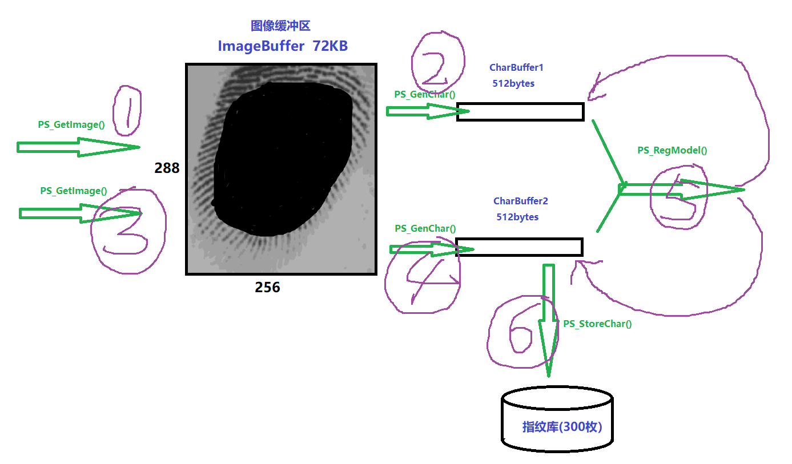
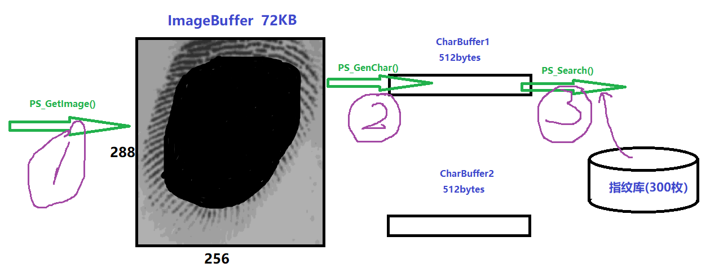
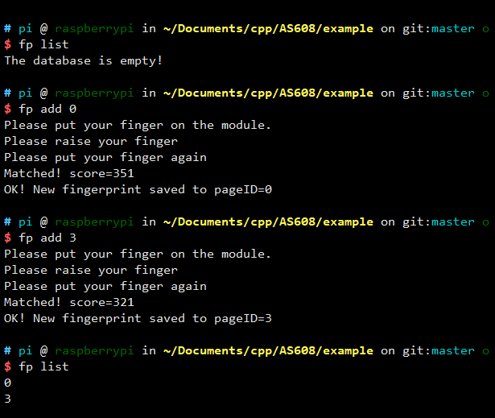
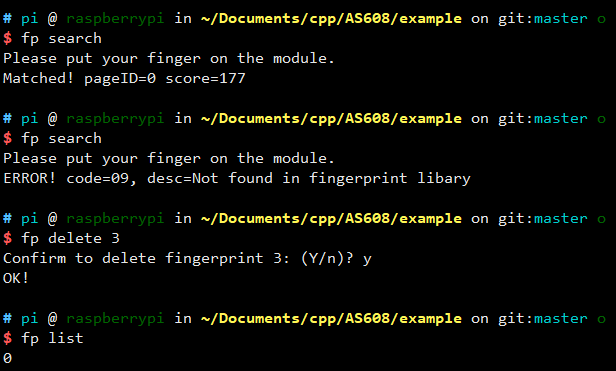

在树莓派上使用AS608模块，本项目实现了所有官方用户开发手册中列出的功能，函数声明在 `as608.h`中。用户可直接调用相应的函数与AS608模块进行通信。

另外，项目中有一个命令行程序，可以在终端下通过命令与模块进行交互。

## 一、AS608

### 1. 简介

数据均存储在模块内，指纹容量300枚(0-299)。

芯片内设有一个 72K 字节的图像缓冲区与二个 512 bytes(256 字)大小的特征文件
缓冲区，名字分别称为：`ImageBuffer`，`CharBuffer1`，`CharBuffer2`。用户可以通过指
令读写任意一个缓冲区。`CharBuffer1` 或 `CharBuffer2` 既可以用于存放普通特征文件也
可以用于存放模板特征文件。

### 2. 工作流程

录入指纹流程：



搜索指纹流程：



AS608模块内部内置了手指探测电路，用户可读取状态引脚(WAK)判断有无手指按下。在本项目组，`as608.h`中的全局变量`g_detect_pin`就是指该引脚与树莓派的哪个GPIO端口相连的。(<font color="red">注意：引脚编码方式是`wiringPi`编码</font>)。读取该引脚的输入信号，高电平意味着模块上有手指存在，否则不存在，等待几秒后，如果一直检测不到手指，就报错。

### 3. 芯片地址和密码

默认地址是`0xffffffff`，默认密码是`0x00000000`，如果不自己设置其他密码，就不需要向模块验证密码，否则，与模块通信的第一条指令必须是验证密码`PS_VfyPwd()`。

## 二、项目-函数库

把本项目根目录下的`as608.h`和`as608.c`拷贝到你的程序目录下即可。

### 1. 模块参数变量

```C++
// typedef unsigned int uint;

typedef struct AS608_Module_Info {
  uint status;      // 状态寄存器 0
  uint model;       // 传感器类型 0-15
  uint capacity;    // 指纹容量，300
  uint secure_level;    // 安全等级 1/2/3/4/5，默认为3
  uint packet_size;     // 数据包大小 32/64/128/256 bytes，默认为128
  uint baud_rate;       // 波特率系数 
  uint chip_addr;       // 设备(芯片)地址                  
  uint password;        // 通信密码
  char product_sn[12];        // 产品型号
  char software_version[12];  // 软件版本号
  char manufacture[12];       // 厂家名称
  char sensor_name[12];       // 传感器名称

  uint detect_pin;      // AS608的WAK引脚连接的树莓派GPIO引脚号
  uint has_password;    // 是否有密码
} AS608;

extern AS608 g_as608;
```

### 2.  全局变量

使用树莓派的硬件进行串口通信，需要额外配置一下(关闭板载蓝牙功能等)，参考 <a href="https://blog.csdn.net/guet_gjl/article/details/85164072" target="_blank">CSDN-树莓派利用串口进行通信</a>。

+ `int g_fd`：打开串口的文件描述符。

```C
g_fd = serialOpen("/dev/ttyAMA0", 9600);  // 9600是波特率
```


+ `int g_verbose`：函数工作过程中输出到屏幕上信息量。为`0`则显示的很少，主要是传输数据包时会显示进度条。为`1`则显示详细信息，如发送的指令包内容和接收的指令包内容等。为`其他`数值则不显示任何信息。

+ `int g_error_code`：模块返回的错误码 以及 自定义的错误代码。

+ `char g_error_desc[128]`：错误代码 的含义。可通过`char* PS_GetErrorDesc()`函数获得。

### 3. 函数

在`as608.c`中每个函数前都有详细注释。

### 4. 如何使用

把本项目根目录下的`as608.h`和`as608.c`拷贝到你的程序目录下并包含头文件。

还需要包含 `<wiringPi.h>` 和 `<wiringSerial.h>`。

最基础的使用如下：

```C
#include <stdio.h>
#include <wiringPi.h>
#include <wiringSerial.h>
#include "as608.h"			// 包含头文件

// 声明全局变量【定义在as608.c】
extern AS608 g_as608;
extern int g_fd;
extern int g_verbose;
extern char  g_error_desc[];
extern uchar g_error_code;

int main() {
    // 给全局变量赋值
    g_as608.detect_pin = 1; 
    g_as608.has_password = 0;  // 没有密码
    g_verbose = 0;       // 显示少量输出信息
    
    // 初始化wiringPi库
    if (-1 == wiringPiSetup())
        return 1;
    
    // 设置g_detect_pin引脚为输入模式
    pinMode(g_as608.detect_pin, INPUT);
    
    // 打开串口
    if ((g_fd = serialOpen("/dev/ttyAMA0", 9600)) < 0)
        return 2;
    
    // 初始化AS608模块
    if (PS_Setup(0xfffffff, 0x00000000) == 0)
        return 3;
    
    /****************************************/
    
    // do something
    
    /****************************************/
    
    // 关闭串口
    serialClose(g_fd);
    
    return 0;
}
```

检测手指

AS608使用的是电阻屏，可以通过检测`WAK`引脚的电平高低来判断模块上是否有手指。

```C
// as608.h 中有一个封装函数
// 检测到手指，返回true，否则返回false
// 前提是配置了 g_as608.detect_pin,  即AS608的WAK引脚
bool PS_DetectFinger();
```

在`exanmple/main.c`中有两个函数

```C++
// 阻塞至检测到手指，最长阻塞wait_time毫秒
bool waitUntilDetectFinger(int wait_time) {
	while (true) {
		if (PS_DetectFinger())
			return true;
		else {
			delay(100);
			wait_time -= 100;
			if (wait_time < 0)
				return false;
		}
	}
}

// 阻塞至检测不到手指，最长阻塞wait_time毫秒
bool waitUntilDetectFinger(int wait_time) {
	while (true) {
		if (PS_DetectFinger())
			return true;
		else {
			delay(100);
			wait_time -= 100;
			if (wait_time < 0)
				return false;
		}
	}
}
```

录入指纹

```C
bool newFingerprint(int pageID) {
	printf("Please put your finger on the module.\n");
	if (waitUntilDetectFinger(5000)) {
		delay(500);
		PS_GetImage();
		PS_GenChar(1);
	}
	else {
		printf("Error: Didn't detect finger!\n");
		exit(1);
	}

	// 判断用户是否抬起了手指，
	printf("Ok.\nPlease raise your finger!\n");
	if (waitUntilNotDetectFinger(5000)) {
		delay(100);
		printf("Ok.\nPlease put your finger again!\n");
		// 第二次录入指纹
		if (waitUntilDetectFinger(5000)) {
			delay(500);
			PS_GetImage();
			PS_GenChar(2);
		}
		else {
			printf("Error: Didn't detect finger!\n");
			exit(1);
		}
	}
	else {
		printf("Error! Didn't raise your finger\n");
		exit(1);
	}

	int score = 0;
	if (PS_Match(&score)) {
		printf("Matched! score=%d\n", score);
	}
	else {
		printf("Not matched, raise your finger and put it on again.\n");
		exit(1);
	}

	// 合并特征文件
	PS_RegModel();
	PS_StoreChar(2, pageID);

	printf("OK! New fingerprint saved to pageID=%d\n", pageID);
}
```

## 三、命令行程序

### 1. 编译运行

```bash
cd example
make
./fp  # 第一次使用，让程序初始化
alias fp=./fp # 以后可以使用fp，而不用加前缀"./"
```

### 2. 修改配置文件

方法一：编辑 `~/.fpconfig` ：执行`vim ~/.fpconfig`

```
address=0xffffffff
password=none
baudrate=9600
detect_pin=1
serial=/dev/ttyAMA0
```

方法二：使用命令

+ `fp cfgaddr [address]` ：修改address
+ `fp cfgpwd [password] `：修改password
+ `fp cfgserial [serialFile]`：修改串口通信端口
+ `fp cfgbaud [baudrate]`：修改通信波特率
+ `fp cfgpin [GPIO_pin]`：修改检测手指是否存在 对于的GPIO引脚

### 3. 如何使用

`fp -h` ：显示使用帮助

```txt
A command line program to interact with AS608 module.

Usage:
  ./fp [command] [param] [option]

Available Commands:
-------------------------------------------------------------------------
  command  | param     | description
-------------------------------------------------------------------------
  cfgaddr   [addr]     Config address in local config file
  cfgpwd    [pwd]      Config password in local config file
  cfgserial [serialFile] Config serial port in local config file. Default:/dev/ttyAMA0
  cfgbaud   [rate]     Config baud rate in local config file
  cfgpin    [GPIO_pin] Config GPIO pin to detect finger in local confilg file

  add       [pID]      Add a new fingerprint to database. (Read twice) 
  enroll    []         Add a new fingerprint to database. (Read only once)
  delete    [pID {count}]  Delete one or contiguous fingerprints.
  empty     []         Empty the database.
  search    []         Collect fingerprint and search in database.
  identify  []         Search
  count     []         Get the count of registered fingerprints.
  list      []         Show the registered fingerprints list.
  info      []         Show the basic parameters of the module.
  random    []         Generate a random number.(0~2^32)

  getimage  []         Collect a fingerprint and store to ImageBuffer.
  upimage   [filename] Download finger image to ras-pi in ImageBuffer of the module
  downimage [filename] Upload finger image to module
  genchar   [cID]      Generate fingerprint feature from ImageBuffer.
  match     []         Accurate comparison of CharBuffer1 and CharBuffer2
                         feature files.
  regmodel  []         Merge the characteristic file in CharBuffer1 and
                         CharBuffer2 and then generate the template, the
                         results are stored in CharBuffer1 and CharBuffer2.
  storechar [cID pID]  Save the template file in CharBuffer1 or CharBuffer2
                         to the flash database location with the PageID number
  loadchar  [cID pID]  Reads the fingerprint template with the ID specified
                         in the flash database into the template buffer,
                         CharBuffer1 or CharBuffer2
  readinf   [filename] Read the FLASH Info Page (512bytes), and save to file
  writenote     [page {note}]   Write note loacted in pageID=page
  readnote      [page]          Read note loacted in pageID=page
  upchar        [cID filename]  Download feature file in CharBufferID to ras-pi
  downchar      [cID filename]  Upload feature file in loacl disk to module
  setpwd        [pwd]           Set password
  vfypwd        [pwd]           Verify password
  packetsize    [{size}]        Show or Set data packet size
  baudrate      [{rate}]        Show or Set baud rate
  level         [{level}]       Show or Set secure level(1~5)
  address       [{addr}]        Show or Set secure level(1~5)

Avaiable options:
  -h    Show help
  -v    Shwo details while excute the order

Usage:
  ./fp [command] [param] [option]

```

**注意事项**

+ 选项 `-v` 或 `-h` <font color="red">必须写到最后面</font>，否则可能出错
+ `[]`中为命令对应的参数，`{}`中的表示可选。

### 4. 示例

```bash
# 录指纹(采集两次)，保存到指纹库的第7号位置
fp add 7
# 录指纹(采集一次)，返回保存的位置id号
fp enroll

# 删除指纹库中第5号指纹
fp delete 5
# 删除指纹库中第0号至第19号(共20个)
fp delete 0 20

# 采集并比对指纹，以下3条均可
fp search
fp hsearch  # high speed search
fp identity

# 列出指纹库中的指纹ID
fp list

# 显示当前的芯片地址
fp address
# 设置芯片地址为0xefefefef
fp address 0xefefefef  # 前缀0x可省略

# 设置密码为0xcc0825cc
fp setpwd 0xcc0825cc
```

【以下图片以实际执行输出为准，可能有差别之处】





## END

<leopard.c@outlook.com>